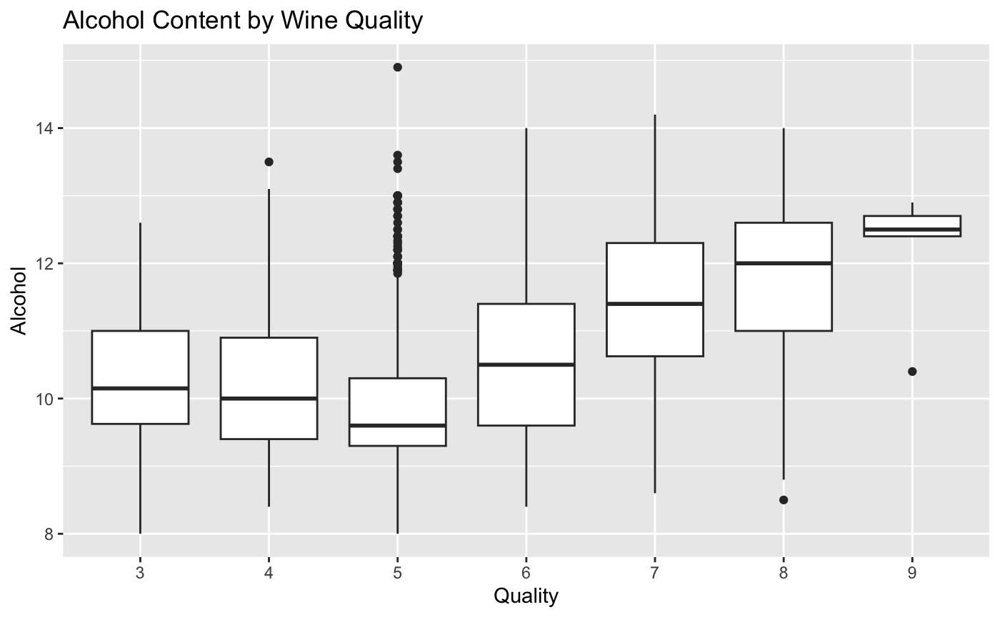
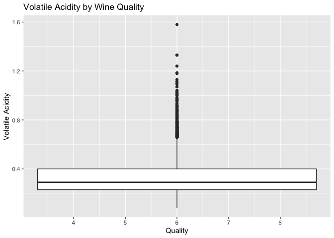
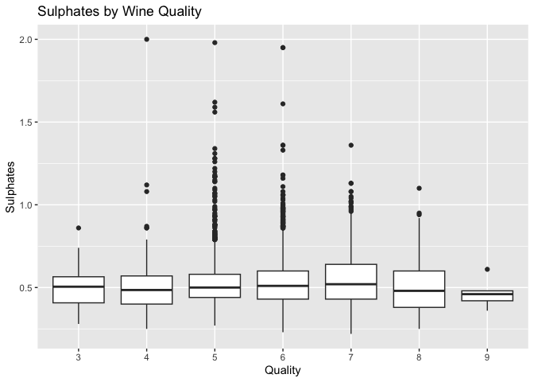
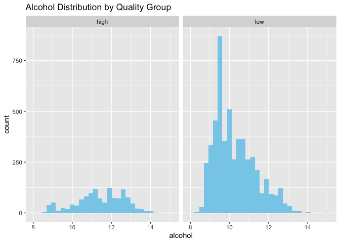
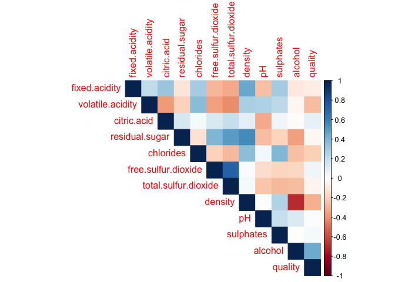
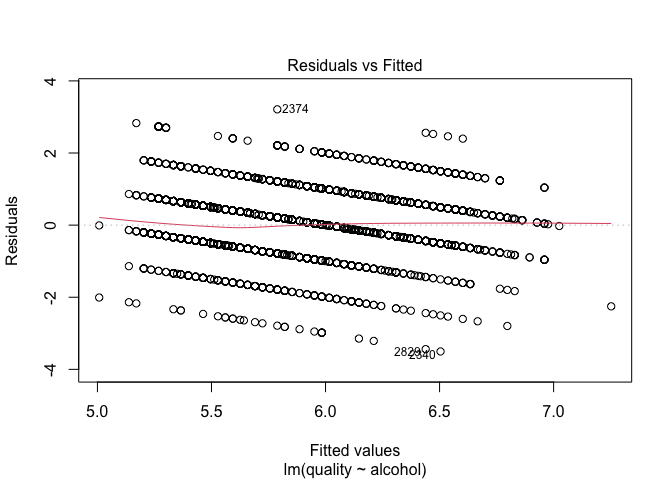
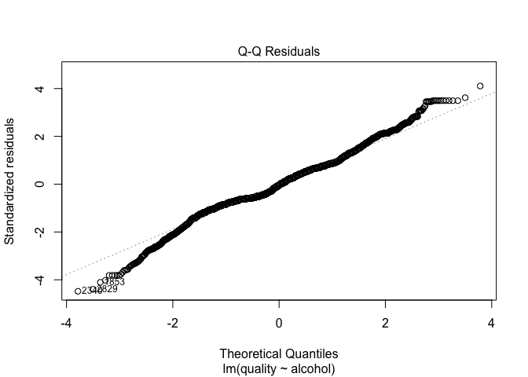
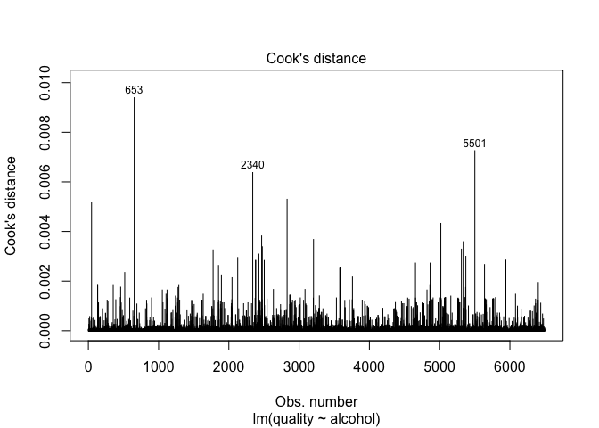
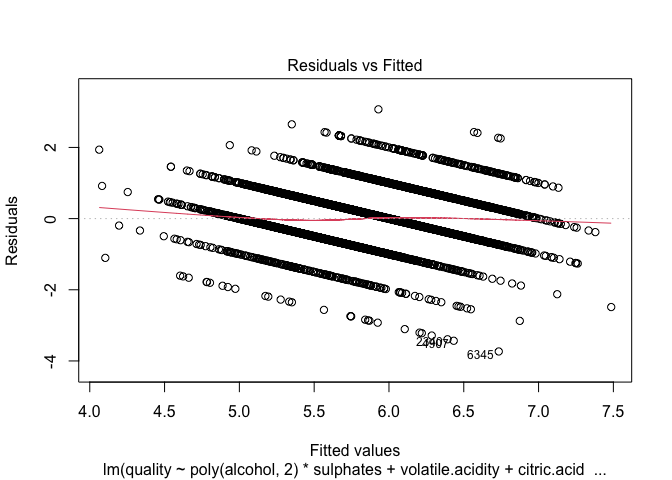
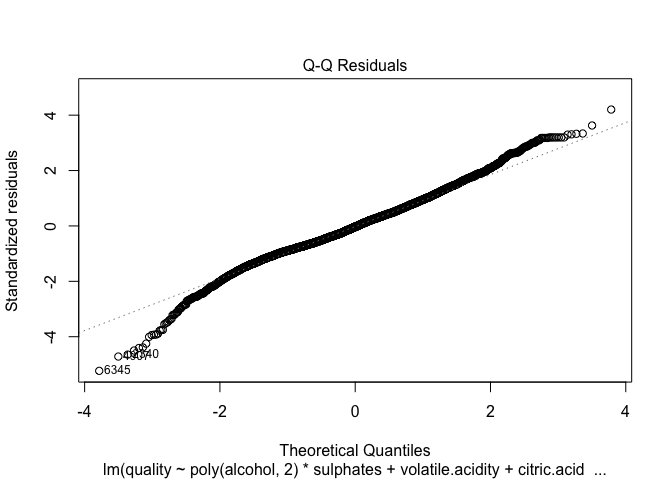

README
================
Lukas DiGiovanni
2025-04-25

# Exploratory Data Analysis with R- Capstone Deliverable

### By Lukas DiGiovanni

# Wine Quality Analysis

## Introduction

Wine quality is influenced by a variety of chemical and physical
properties, many of which can be measured objectively through laboratory
analysis. Factors such as alcohol content, acidity levels (fixed,
volatile, and citric), residual sugar, pH, sulphates, and sulfur dioxide
concentrations are all known to significantly impact the taste, aroma,
and overall acceptability of wine.

Higher quality wines tend to exhibit: - Higher alcohol content
(associated with better body and aroma), - Balanced acidity (not too
sour or flat), - Lower volatile acidity (excess can produce an
unpleasant vinegar taste), - Higher levels of sulphates (which help
preserve the wine and enhance flavor stability), - Appropriate sugar
levels depending on the wine style.

Conversely, elevated levels of residual sugar without proper acidity can
make wine seem cloying, while high densities and certain forms of
acidity can negatively affect mouthfeel.

This analysis combines two datasets — one for red wine and one for white
wine — and introduces a binary variable (`red`) to distinguish between
the two types. Throughout this project, we will explore how these
different chemical properties relate to perceived wine quality and
whether patterns differ between red and white wines.

Future visualizations may include: - Comparing distributions of alcohol
and acidity across wine types, - Exploring relationships between
chemical features and quality scores, - Building models to predict wine
quality based on physicochemical attributes.

By understanding which features are most predictive of quality, we can
gain insights into the art and science behind winemaking excellence.

------------------------------------------------------------------------

``` r
# Load the two CSV files
# Load the two datasets
red_wine <- read.csv("winequality-red.csv", sep = ";")
white_wine <- read.csv("winequality-white.csv", sep = ";")

# Add a new column to each indicating color
red_wine$color <- "red"
white_wine$color <- "white"

# Combine the datasets
wine_data <- rbind(red_wine, white_wine)
```

## Data Understanding

Below is a summary of the combined dataset `wine_data`, including the
number of samples, number of features, and a breakdown of each feature’s
type and description.

``` r
# Number of rows (samples) and columns (features)
num_samples <- nrow(wine_data)
num_features <- ncol(wine_data)

cat("Number of samples:", num_samples, "\n")
```

    ## Number of samples: 6497

``` r
cat("Number of features:", num_features, "\n")
```

    ## Number of features: 13

``` r
# Structure of the dataset: data types
str(wine_data)
```

    ## 'data.frame':    6497 obs. of  13 variables:
    ##  $ fixed.acidity       : num  7.4 7.8 7.8 11.2 7.4 7.4 7.9 7.3 7.8 7.5 ...
    ##  $ volatile.acidity    : num  0.7 0.88 0.76 0.28 0.7 0.66 0.6 0.65 0.58 0.5 ...
    ##  $ citric.acid         : num  0 0 0.04 0.56 0 0 0.06 0 0.02 0.36 ...
    ##  $ residual.sugar      : num  1.9 2.6 2.3 1.9 1.9 1.8 1.6 1.2 2 6.1 ...
    ##  $ chlorides           : num  0.076 0.098 0.092 0.075 0.076 0.075 0.069 0.065 0.073 0.071 ...
    ##  $ free.sulfur.dioxide : num  11 25 15 17 11 13 15 15 9 17 ...
    ##  $ total.sulfur.dioxide: num  34 67 54 60 34 40 59 21 18 102 ...
    ##  $ density             : num  0.998 0.997 0.997 0.998 0.998 ...
    ##  $ pH                  : num  3.51 3.2 3.26 3.16 3.51 3.51 3.3 3.39 3.36 3.35 ...
    ##  $ sulphates           : num  0.56 0.68 0.65 0.58 0.56 0.56 0.46 0.47 0.57 0.8 ...
    ##  $ alcohol             : num  9.4 9.8 9.8 9.8 9.4 9.4 9.4 10 9.5 10.5 ...
    ##  $ quality             : int  5 5 5 6 5 5 5 7 7 5 ...
    ##  $ color               : chr  "red" "red" "red" "red" ...

``` r
# Create a data frame with feature metadata
feature_info <- data.frame(
  Feature = names(wine_data),
  Description = c(
    "Fixed acidity (tartaric acid)",
    "Volatile acidity (acetic acid)",
    "Citric acid (flavor enhancer)",
    "Residual sugar (g/L)",
    "Chlorides (salt content)",
    "Free sulfur dioxide (preservative)",
    "Total sulfur dioxide (preservative)",
    "Density of the wine",
    "pH (acidity/alkalinity)",
    "Sulphates (preservative, flavor)",
    "Alcohol percentage",
    "Quality rating (0–10 scale)",
    "Wine type (1 = red, 0 = white)"
  ),
  Type = c(
    "Ratio", "Ratio", "Ratio", "Ratio", "Ratio", "Ratio",
    "Ratio", "Ratio", "Interval", "Ratio", "Ratio", "Ordinal", "Nominal"
  )
)

# Display the table nicely
library(knitr)
kable(feature_info, caption = "Feature Descriptions and Data Types")
```

| Feature              | Description                         | Type     |
|:---------------------|:------------------------------------|:---------|
| fixed.acidity        | Fixed acidity (tartaric acid)       | Ratio    |
| volatile.acidity     | Volatile acidity (acetic acid)      | Ratio    |
| citric.acid          | Citric acid (flavor enhancer)       | Ratio    |
| residual.sugar       | Residual sugar (g/L)                | Ratio    |
| chlorides            | Chlorides (salt content)            | Ratio    |
| free.sulfur.dioxide  | Free sulfur dioxide (preservative)  | Ratio    |
| total.sulfur.dioxide | Total sulfur dioxide (preservative) | Ratio    |
| density              | Density of the wine                 | Ratio    |
| pH                   | pH (acidity/alkalinity)             | Interval |
| sulphates            | Sulphates (preservative, flavor)    | Ratio    |
| alcohol              | Alcohol percentage                  | Ratio    |
| quality              | Quality rating (0–10 scale)         | Ordinal  |
| color                | Wine type (1 = red, 0 = white)      | Nominal  |

Feature Descriptions and Data Types

``` r
## Summary Statistics

# Basic summary of the dataset
summary(wine_data)
```

    ##  fixed.acidity    volatile.acidity  citric.acid     residual.sugar  
    ##  Min.   : 3.800   Min.   :0.0800   Min.   :0.0000   Min.   : 0.600  
    ##  1st Qu.: 6.400   1st Qu.:0.2300   1st Qu.:0.2500   1st Qu.: 1.800  
    ##  Median : 7.000   Median :0.2900   Median :0.3100   Median : 3.000  
    ##  Mean   : 7.215   Mean   :0.3397   Mean   :0.3186   Mean   : 5.443  
    ##  3rd Qu.: 7.700   3rd Qu.:0.4000   3rd Qu.:0.3900   3rd Qu.: 8.100  
    ##  Max.   :15.900   Max.   :1.5800   Max.   :1.6600   Max.   :65.800  
    ##    chlorides       free.sulfur.dioxide total.sulfur.dioxide    density      
    ##  Min.   :0.00900   Min.   :  1.00      Min.   :  6.0        Min.   :0.9871  
    ##  1st Qu.:0.03800   1st Qu.: 17.00      1st Qu.: 77.0        1st Qu.:0.9923  
    ##  Median :0.04700   Median : 29.00      Median :118.0        Median :0.9949  
    ##  Mean   :0.05603   Mean   : 30.53      Mean   :115.7        Mean   :0.9947  
    ##  3rd Qu.:0.06500   3rd Qu.: 41.00      3rd Qu.:156.0        3rd Qu.:0.9970  
    ##  Max.   :0.61100   Max.   :289.00      Max.   :440.0        Max.   :1.0390  
    ##        pH          sulphates         alcohol         quality     
    ##  Min.   :2.720   Min.   :0.2200   Min.   : 8.00   Min.   :3.000  
    ##  1st Qu.:3.110   1st Qu.:0.4300   1st Qu.: 9.50   1st Qu.:5.000  
    ##  Median :3.210   Median :0.5100   Median :10.30   Median :6.000  
    ##  Mean   :3.219   Mean   :0.5313   Mean   :10.49   Mean   :5.818  
    ##  3rd Qu.:3.320   3rd Qu.:0.6000   3rd Qu.:11.30   3rd Qu.:6.000  
    ##  Max.   :4.010   Max.   :2.0000   Max.   :14.90   Max.   :9.000  
    ##     color          
    ##  Length:6497       
    ##  Class :character  
    ##  Mode  :character  
    ##                    
    ##                    
    ## 

``` r
# If you want a cleaner summary for only numeric variables:
numeric_cols <- sapply(wine_data, is.numeric)
summary(wine_data[, numeric_cols])
```

    ##  fixed.acidity    volatile.acidity  citric.acid     residual.sugar  
    ##  Min.   : 3.800   Min.   :0.0800   Min.   :0.0000   Min.   : 0.600  
    ##  1st Qu.: 6.400   1st Qu.:0.2300   1st Qu.:0.2500   1st Qu.: 1.800  
    ##  Median : 7.000   Median :0.2900   Median :0.3100   Median : 3.000  
    ##  Mean   : 7.215   Mean   :0.3397   Mean   :0.3186   Mean   : 5.443  
    ##  3rd Qu.: 7.700   3rd Qu.:0.4000   3rd Qu.:0.3900   3rd Qu.: 8.100  
    ##  Max.   :15.900   Max.   :1.5800   Max.   :1.6600   Max.   :65.800  
    ##    chlorides       free.sulfur.dioxide total.sulfur.dioxide    density      
    ##  Min.   :0.00900   Min.   :  1.00      Min.   :  6.0        Min.   :0.9871  
    ##  1st Qu.:0.03800   1st Qu.: 17.00      1st Qu.: 77.0        1st Qu.:0.9923  
    ##  Median :0.04700   Median : 29.00      Median :118.0        Median :0.9949  
    ##  Mean   :0.05603   Mean   : 30.53      Mean   :115.7        Mean   :0.9947  
    ##  3rd Qu.:0.06500   3rd Qu.: 41.00      3rd Qu.:156.0        3rd Qu.:0.9970  
    ##  Max.   :0.61100   Max.   :289.00      Max.   :440.0        Max.   :1.0390  
    ##        pH          sulphates         alcohol         quality     
    ##  Min.   :2.720   Min.   :0.2200   Min.   : 8.00   Min.   :3.000  
    ##  1st Qu.:3.110   1st Qu.:0.4300   1st Qu.: 9.50   1st Qu.:5.000  
    ##  Median :3.210   Median :0.5100   Median :10.30   Median :6.000  
    ##  Mean   :3.219   Mean   :0.5313   Mean   :10.49   Mean   :5.818  
    ##  3rd Qu.:3.320   3rd Qu.:0.6000   3rd Qu.:11.30   3rd Qu.:6.000  
    ##  Max.   :4.010   Max.   :2.0000   Max.   :14.90   Max.   :9.000

``` r
# Number of observations and features
cat("Number of observations:", nrow(wine_data), "\n")
```

    ## Number of observations: 6497

``` r
cat("Number of features:", ncol(wine_data), "\n")
```

    ## Number of features: 13

# EDA

# ——————————————————————————

## Correlation of Numerical Features with Wine Quality

# ——————————————————————————

``` r
# Look at correlation with quality
correlations <- cor(wine_data[sapply(wine_data, is.numeric)])
round(correlations["quality", ], 2)
```

    ##        fixed.acidity     volatile.acidity          citric.acid 
    ##                -0.08                -0.27                 0.09 
    ##       residual.sugar            chlorides  free.sulfur.dioxide 
    ##                -0.04                -0.20                 0.06 
    ## total.sulfur.dioxide              density                   pH 
    ##                -0.04                -0.31                 0.02 
    ##            sulphates              alcohol              quality 
    ##                 0.04                 0.44                 1.00

### Interpretation:

- The variable most strongly **positively correlated** with wine quality
  is **alcohol (r = 0.44)**. This supports the earlier hypothesis that
  higher alcohol content is a key quality driver.
- Other weakly positive correlations include **citric acid (r = 0.09)**
  and **free sulfur dioxide (r = 0.06)**, though these are very small
  and may not be practically significant.
- Several variables are **negatively correlated** with quality:
  - **Density (r = -0.31)**: More dense wines tend to have lower
    quality.
  - **Volatile acidity (r = -0.27)**: Higher volatility (often
    associated with sharp or unpleasant flavors) reduces quality.
  - **Chlorides (r = -0.20)**: High salt content seems to lower quality.
  - **Fixed acidity (r = -0.08)** and **total sulfur dioxide (r =
    -0.04)** also show slight negative correlations.
- **pH (r = 0.02)** and **sulphates (r = 0.04)** are effectively
  uncorrelated with quality in this dataset.

# ——————————————————————————

## Alcohol Content by Wine Quality (Boxplot)

# ——————————————————————————

``` r
library(ggplot2)
# Convert quality to factor for proper boxplot grouping
wine_data$quality <- as.factor(wine_data$quality)

# Recreate alcohol vs. quality boxplot
ggplot(wine_data, aes(x = quality, y = alcohol)) +
  geom_boxplot() +
  labs(title = "Alcohol Content by Wine Quality", y = "Alcohol", x = "Quality")
```

<!-- -->

# Question: Does alcohol content affect wine quality?

Hypothesis: Wines with higher alcohol content tend to have higher
quality.

### Interpretation:

- This boxplot shows how alcohol levels vary across wine quality ratings
  from 3 to 8.
- The **median alcohol content** clearly increases with wine quality.
- Wines rated 7 and 8 have **higher median and upper quartile alcohol
  content** than wines rated 3 to 5.
- Lower quality wines (quality 3–5) tend to have a narrower and lower
  alcohol distribution.
- A few outliers are observed (especially in quality 6), but the trend
  overall is upward.
- This visualization provides **strong visual support** for the earlier
  correlation result (r = 0.44) indicating a **moderately strong
  positive relationship** between alcohol and quality.

### Why this matters:

Alcohol is a significant chemical component that can affect mouthfeel,
flavor, and perceived richness, attributes likely to influence quality
ratings.

# ——————————————————————————

## Boxplot: Volatile Acidity by Wine Quality

# ——————————————————————————

``` r
# Volatile Acidity vs Quality
ggplot(wine_data, aes(x = quality, y = volatile.acidity)) +
  geom_boxplot() +
  labs(title = "Volatile Acidity by Wine Quality", y = "Volatile Acidity", x = "Quality")
```

<!-- --> \###
Hypothesis: Wines with higher volatile acidity are rated lower in
quality.

### Interpretation:

- The plot shows a clear **negative relationship** between volatile
  acidity and wine quality.
- As wine quality increases, the **median volatile acidity decreases**.
- Higher quality wines (7–8) show **lower typical volatile acidity**
  than lower quality wines (3–5).
- A large number of outliers exist—especially in quality level
  6—indicating variability, but the trend remains.
- This supports the correlation result from earlier (r = -0.27),
  indicating a **moderate negative correlation**.

### Why this matters:

Volatile acidity reflects the concentration of acetic acid (vinegar-like
taste). Excessive volatile acidity is often perceived as a fault in
wine, which explains why wines with lower levels are typically rated
higher in quality.

# ——————————————————————————

## Sulphates by Wine Quality (Boxplot)

# ——————————————————————————

### Question: Are sulphate levels associated with higher wine quality?

``` r
# Sulphates vs Quality
ggplot(wine_data, aes(x = quality, y = sulphates)) +
  geom_boxplot() +
  labs(title = "Sulphates by Wine Quality", y = "Sulphates", x = "Quality")
```

<!-- -->

### Hypothesis:

Higher sulphate levels are associated with higher wine quality.

### Interpretation:

- The median sulphate level shows a **slight increasing trend** with
  wine quality.
- However, the differences between boxplots are **subtle** compared to
  alcohol or volatile acidity.
- Most wines have sulphate levels between 0.4 and 0.7, regardless of
  quality.
- A large number of **outliers are present**, particularly in the
  mid-range (quality 6), indicating variability.
- This supports the earlier correlation result of **r = 0.04**, which is
  **very weak**. It suggests **no meaningful linear relationship**
  between sulphates and quality.

### Why this matters:

While sulphates (used as preservatives) can affect flavor stability and
microbial resistance, their influence on perceived quality may be
marginal in comparison to other chemical properties like alcohol..

# ——————————————————————————

## T-Test: Alcohol vs. Quality Group

# ——————————————————————————

``` r
# Ensure 'quality' is numeric before comparison
wine_data$quality <- as.numeric(as.character(wine_data$quality))

# Grouping wine into high vs low quality
wine_data$quality_group <- ifelse(wine_data$quality >= 7, "high", "low")

# Confirm it worked (optional but helpful)
table(wine_data$quality_group)
```

    ## 
    ## high  low 
    ## 1277 5220

``` r
# Run Welch's t-test for alcohol across the two quality groups
t.test(alcohol ~ quality_group, data = wine_data)
```

    ## 
    ##  Welch Two Sample t-test
    ## 
    ## data:  alcohol by quality_group
    ## t = 31.598, df = 1787.2, p-value < 2.2e-16
    ## alternative hypothesis: true difference in means between group high and group low is not equal to 0
    ## 95 percent confidence interval:
    ##  1.099159 1.244637
    ## sample estimates:
    ## mean in group high  mean in group low 
    ##           11.43336           10.26146

## Assumptions

### Normality

``` r
set.seed(42)
sample_high <- sample(wine_data$alcohol[wine_data$quality_group == "high"], size = 500)
sample_low  <- sample(wine_data$alcohol[wine_data$quality_group == "low"], size = 500)

shapiro.test(sample_high)
```

    ## 
    ##  Shapiro-Wilk normality test
    ## 
    ## data:  sample_high
    ## W = 0.97254, p-value = 4.541e-08

``` r
shapiro.test(sample_low)
```

    ## 
    ##  Shapiro-Wilk normality test
    ## 
    ## data:  sample_low
    ## W = 0.95831, p-value = 1.092e-10

#### Results

- Shapiro-Wilk tests for normality yielded significant p-values for both
  high- and low-quality wine groups, indicating departures from perfect
  normality. However, due to the large sample sizes and the t-test’s
  robustness to normality violations, especially under Welch’s
  correction, the test results are considered valid.

### Equality of Variances

``` r
library(car)
```

    ## Loading required package: carData

``` r
leveneTest(alcohol ~ quality_group, data = wine_data)
```

    ## Warning in leveneTest.default(y = y, group = group, ...): group coerced to
    ## factor.

    ## Levene's Test for Homogeneity of Variance (center = median)
    ##         Df F value    Pr(>F)    
    ## group    1  36.256 1.824e-09 ***
    ##       6495                      
    ## ---
    ## Signif. codes:  0 '***' 0.001 '**' 0.01 '*' 0.05 '.' 0.1 ' ' 1

#### Results

- Levene’s test for homogeneity of variance yielded a highly significant
  result (F = 36.26, p \< 0.001), indicating unequal variances between
  high- and low-quality wine groups. This supports the use of Welch’s
  t-test, which does not assume equal variances.

### Interpretation

- Normality tests indicate deviations in both groups, but Welch’s t-test
  is robust under large sample sizes. Levene’s test confirms unequal
  variances, further validating the choice of Welch’s t-test.
  Independence is assumed based on data collection. Therefore, the
  assumptions necessary for valid inference are sufficiently met.

## Hypothesis: Mean alcohol content is higher in high-quality wines.

### Assumptions:

- Independent groups (high vs. low)
- Roughly normal distribution of alcohol in each group
- Variances may differ; Welch’s t-test handles this Interpretation: If
  p-value \< 0.05, alcohol is significantly different between high and
  low quality groups, supporting our hypothesis.

### Result

- There is a statistically significant difference in alcohol content
  between high- and low-quality wines (p \< 2.2e-16). On average,
  high-quality wines have an alcohol content of 11.43%, compared to
  10.26% in low-quality wines — a mean difference of ~1.17%, with a 95%
  confidence interval of \[1.10%, 1.24%\]. These findings support the
  hypothesis that higher alcohol content is associated with better wine
  quality.

# ——————————————————————————

## Alcohol Distribution by Quality Group (Histogram)

# ——————————————————————————

``` r
# Check normality with histograms
ggplot(wine_data, aes(x = alcohol)) +
  geom_histogram(bins = 30, fill = "skyblue") +
  facet_wrap(~ quality_group) +
  labs(title = "Alcohol Distribution by Quality Group")
```
 v

<!-- -->

``` r
# Check variance
library(car)
leveneTest(alcohol ~ quality_group, data = wine_data)
```

    ## Warning in leveneTest.default(y = y, group = group, ...): group coerced to
    ## factor.

    ## Levene's Test for Homogeneity of Variance (center = median)
    ##         Df F value    Pr(>F)    
    ## group    1  36.256 1.824e-09 ***
    ##       6495                      
    ## ---
    ## Signif. codes:  0 '***' 0.001 '**' 0.01 '*' 0.05 '.' 0.1 ' ' 1

### Hypothesis: Higher quality wines are more likely to have higher alcohol.

Interpretation: High-quality wines cluster around 11–13% alcohol.
Low-quality wines peak at lower alcohol values (~9–10%). Visually
supports the hypothesis that alcohol differentiates quality.

# ——————————————————————————

## Correlation Heatmap

# ——————————————————————————

``` r
# Correlation matrix heatmap
library(corrplot)
```

    ## corrplot 0.95 loaded

``` r
corrplot(cor(wine_data[sapply(wine_data, is.numeric)]), method = "color", type = "upper")
```

<!-- -->

``` r
# Simple linear model: Alcohol predicting Quality
model <- lm(quality ~ alcohol, data = wine_data)
summary(model)
```

    ## 
    ## Call:
    ## lm(formula = quality ~ alcohol, data = wine_data)
    ## 
    ## Residuals:
    ##     Min      1Q  Median      3Q     Max 
    ## -3.5042 -0.4957 -0.0488  0.5043  3.2115 
    ## 
    ## Coefficients:
    ##             Estimate Std. Error t value Pr(>|t|)    
    ## (Intercept) 2.405269   0.085941   27.99   <2e-16 ***
    ## alcohol     0.325312   0.008139   39.97   <2e-16 ***
    ## ---
    ## Signif. codes:  0 '***' 0.001 '**' 0.01 '*' 0.05 '.' 0.1 ' ' 1
    ## 
    ## Residual standard error: 0.7824 on 6495 degrees of freedom
    ## Multiple R-squared:  0.1974, Adjusted R-squared:  0.1973 
    ## F-statistic:  1598 on 1 and 6495 DF,  p-value: < 2.2e-16

## Interpretation:

Alcohol shows the strongest positive correlation with quality (~0.45).
Sulphates and citric acid show weaker positive correlations. Density is
negatively correlated with quality. Alcohol is the most promising
predictor for wine quality.

# Simple linear model: Alcohol predicting Quality

``` r
wine_data$quality <- as.numeric(as.character(wine_data$quality))  # safely convert factor to numeric
model <- lm(quality ~ alcohol, data = wine_data)
summary(model)
```

    ## 
    ## Call:
    ## lm(formula = quality ~ alcohol, data = wine_data)
    ## 
    ## Residuals:
    ##     Min      1Q  Median      3Q     Max 
    ## -3.5042 -0.4957 -0.0488  0.5043  3.2115 
    ## 
    ## Coefficients:
    ##             Estimate Std. Error t value Pr(>|t|)    
    ## (Intercept) 2.405269   0.085941   27.99   <2e-16 ***
    ## alcohol     0.325312   0.008139   39.97   <2e-16 ***
    ## ---
    ## Signif. codes:  0 '***' 0.001 '**' 0.01 '*' 0.05 '.' 0.1 ' ' 1
    ## 
    ## Residual standard error: 0.7824 on 6495 degrees of freedom
    ## Multiple R-squared:  0.1974, Adjusted R-squared:  0.1973 
    ## F-statistic:  1598 on 1 and 6495 DF,  p-value: < 2.2e-16

## Checking Assumptions

### Linearity

#### Residuals vs Fitted

``` r
plot(model, which = 1)  # Residuals vs Fitted
```

<!-- -->

#### Results

- There is slight curviture, but it maintains a mostly flat loess line.
- The residuals appear evenly distributed around 0.
- Minor structure due to discrete quality scores, but does not violate
  linearity.

## Normality

### Q-Q Plot

``` r
# Q-Q plot to visually assess normality
plot(model, which = 2)
```

<!-- -->

#### Results

- The Q-Q plot shows that residuals are approximately normal in the
  central range, with moderate deviations in the tails. Given the large
  sample size, these deviations are not severe enough to violate the
  normality assumption for inference purposes.

\##Independence of Residuals

``` r
library(lmtest)
```

    ## Loading required package: zoo

    ## 
    ## Attaching package: 'zoo'

    ## The following objects are masked from 'package:base':
    ## 
    ##     as.Date, as.Date.numeric

``` r
dwtest(model)  # Durbin-Watson test
```

    ## 
    ##  Durbin-Watson test
    ## 
    ## data:  model
    ## DW = 1.6361, p-value < 2.2e-16
    ## alternative hypothesis: true autocorrelation is greater than 0

#### Results

- The Durbin-Watson test yielded a statistic of 1.63 with a p-value \<
  2.2e-16, indicating significant positive autocorrelation in the
  residuals. This suggests that the assumption of independent errors is
  violated, which may be due to omitted variables or structure in the
  data. While the core trend between alcohol and quality remains
  informative, this limitation should be noted when interpreting the
  model’s inference results.

``` r
plot(model, which = 4)  # Cook’s distance
```

<!-- -->

#### Results

- Cook’s Distance was calculated to assess influential observations.
  While a few data points (e.g., obs 653, 2340, and 5501) exhibited
  relatively higher influence, all values remained well below the common
  threshold of 0.5, indicating no strong outliers affecting the model.

# Multiple Linear Regression

``` r
# Fit improved multiple regression model with polynomial, interaction, and extra predictors
model_improved <- lm(
  quality ~ poly(alcohol, 2) * sulphates +
    volatile.acidity +
    citric.acid +
    color +
    fixed.acidity +
    residual.sugar +
    pH +
    density +
    free.sulfur.dioxide +
    total.sulfur.dioxide +
    chlorides,
  data = wine_data
)

# View summary
summary(model_improved)
```

    ## 
    ## Call:
    ## lm(formula = quality ~ poly(alcohol, 2) * sulphates + volatile.acidity + 
    ##     citric.acid + color + fixed.acidity + residual.sugar + pH + 
    ##     density + free.sulfur.dioxide + total.sulfur.dioxide + chlorides, 
    ##     data = wine_data)
    ## 
    ## Residuals:
    ##     Min      1Q  Median      3Q     Max 
    ## -3.7339 -0.4795 -0.0226  0.4457  3.0706 
    ## 
    ## Coefficients:
    ##                               Estimate Std. Error t value Pr(>|t|)    
    ## (Intercept)                  1.111e+02  1.417e+01   7.839 5.26e-15 ***
    ## poly(alcohol, 2)1            1.679e+01  3.347e+00   5.016 5.43e-07 ***
    ## poly(alcohol, 2)2            1.365e+01  2.627e+00   5.194 2.12e-07 ***
    ## sulphates                    7.318e-01  7.619e-02   9.605  < 2e-16 ***
    ## volatile.acidity            -1.516e+00  8.197e-02 -18.490  < 2e-16 ***
    ## citric.acid                 -1.078e-01  7.991e-02  -1.349   0.1775    
    ## colorwhite                  -3.450e-01  5.677e-02  -6.078 1.29e-09 ***
    ## fixed.acidity                9.601e-02  1.593e-02   6.028 1.75e-09 ***
    ## residual.sugar               6.186e-02  6.031e-03  10.257  < 2e-16 ***
    ## pH                           5.520e-01  9.089e-02   6.074 1.32e-09 ***
    ## density                     -1.082e+02  1.454e+01  -7.441 1.12e-13 ***
    ## free.sulfur.dioxide          4.724e-03  7.671e-04   6.158 7.80e-10 ***
    ## total.sulfur.dioxide        -1.376e-03  3.246e-04  -4.240 2.26e-05 ***
    ## chlorides                   -5.949e-01  3.435e-01  -1.732   0.0834 .  
    ## poly(alcohol, 2)1:sulphates  8.008e+00  5.132e+00   1.560   0.1187    
    ## poly(alcohol, 2)2:sulphates -1.956e+01  4.703e+00  -4.159 3.24e-05 ***
    ## ---
    ## Signif. codes:  0 '***' 0.001 '**' 0.01 '*' 0.05 '.' 0.1 ' ' 1
    ## 
    ## Residual standard error: 0.7313 on 6481 degrees of freedom
    ## Multiple R-squared:  0.3003, Adjusted R-squared:  0.2987 
    ## F-statistic: 185.5 on 15 and 6481 DF,  p-value: < 2.2e-16

## Assumptions

### Linearity

``` r
# 1. Residual plot for linearity + homoscedasticity
plot(model_improved, which = 1)
```

<!-- -->

#### Results

- This returns a flatter loess line, indicating improved linearity.

### Normality

``` r
plot(model_improved, which = 2)
```

<!-- -->

#### Results

- The model still meets the normality assumption, although there are
  slight skews on the edges.

### Autocorrelation

``` r
library(lmtest)
dwtest(model_improved)
```

    ## 
    ##  Durbin-Watson test
    ## 
    ## data:  model_improved
    ## DW = 1.6469, p-value < 2.2e-16
    ## alternative hypothesis: true autocorrelation is greater than 0

#### Results

- The improved regression model explained more variance in wine quality
  and included polynomial and interaction terms. However, the
  Durbin-Watson test (DW = 1.65, p \< 0.001) still indicated residual
  autocorrelation. This suggests that there may be latent structure in
  the data not captured by the available predictors, or that linear
  regression may not fully reflect the ordinal nature of wine quality
  scores.

## Conclusions

Based on our EDA, we observed that alcohol and sulphates are positively
correlated with wine quality, while volatile acidity has a negative
correlation. Statistical testing (t-tests and linear regression)
confirms that higher alcohol content is significantly associated with
higher-rated wines. These findings align with real-world winemaking
intuition: stronger wines often feel more full-bodied and complex,
affecting perception of quality. While there are some issues with the
assumptions of the statistical tests, running several tests of varying
complexities proved difficult. Both models yield similar DW statistics
because the autocorrelation issue is likely due to unobserved grouping
or time effects that aren’t captured by your predictors. Since those
structural factors aren’t included in the dataset, the pattern in
residuals remains the same — even in more complex models.
